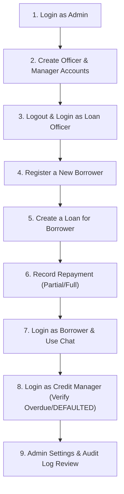

# Testing & System Navigation Guide — Loan Reminder Alert System

This document is a step-by-step walkthrough to test every feature of the **Due Date Loan Payment Alert System** by navigating through the application.

---

## 1. Quick Start / Environment Credentials

### Base URLs
- **Hosted App**: `https://loan-reminder-one.vercel.app`
- **Frontend App**: `http://localhost:5173`
- **Backend API**: `http://localhost:3000` (or `http://localhost:3005`)

### Default Seeded Users (Prisma Seed)
| User Role | Email | Password | Allowed Access |
|---|---|---|---|
| **Admin** | `admin@loanreminder.com` | `Admin123!` | Full System Access (Users, Settings, Audit Logs, All Loans, Borrowers) |
| **Loan Officer** | *(Create via Admin)* | *(Sent via Email)* | Register Borrowers, Create Loans, Record Payments, Chat with Borrowers |
| **Credit Manager** | *(Create via Admin)* | *(Sent via Email)* | View Dashboard Metrics, View Loans, Change Loan Status to DEFAULTED, View Audit Logs |
| **Borrower** | *(Create via Officer)* | `Borrower123!` *(or set via Email link)* | View Personal Dashboard, View Personal Loans, Chat with Assigned Officer |

---

## 2. Recommended End-to-End Testing Workflow

Follow this sequence to test all user roles and system features:

---

## 3. Detailed Step-by-Step Navigation Guide

### Step 1: Admin System Setup & User Management
1. Go to `http://localhost:5173/login`.
2. Login with:
   - **Email**: `admin@loanreminder.com`
   - **Password**: `Admin123!`
3. Navigate to **Users** in the sidebar (`/users`):
   - Click **+ Add User**.
   - Create a **Loan Officer**:
     - Name: `Jane Officer`
     - Email: `officer@loanreminder.com`
     - Role: `LOAN_OFFICER`
     - Password: `Password123!`
   - Create a **Credit Manager**:
     - Name: `Mark Manager`
     - Email: `manager@loanreminder.com`
     - Role: `CREDIT_MANAGER`
     - Password: `Password123!`
4. Verify that welcome emails with password setup links were dispatched to the specified emails via the Notify API.

---

### Step 2: Loan Officer Operations (Borrower & Loan Lifecycle)
1. Logout from Admin and login as `officer@loanreminder.com` / `Password123!`.
2. Navigate to **Borrowers** (`/borrowers`):
   - Click **+ Add Borrower**.
   - Fill in National ID, Full Name, Phone (`+25078...`), Email, Occupation, and Guarantor details.
   - Click **Save Borrower**. (An activation email with a reset password link is automatically sent to the borrower).
3. Navigate to **Loans** (`/loans`):
   - Click **+ Create Loan**.
   - Select the registered Borrower.
   - Set **Principal Amount** (e.g., `100,000`), **Interest Rate** (e.g., `0.1` for 10%), **Frequency** (`WEEKLY`), **Loan Date** (today), and **Due Date** (1 month from today).
   - Click **Create Loan**.
4. View the generated **Repayment Schedule**:
   - Click on the created loan to open **Loan Detail** (`/loans/:id`).
   - Observe the auto-generated installment breakdown and payment progress bar.

---

### Step 3: Repayment Recording & Automated Math
1. Inside the **Loan Detail** page (`/loans/:id`):
   - Click **Record Payment**.
   - Enter an amount (e.g., `25,000` for a partial payment or full installment amount).
   - Select **Payment Method** (`MOBILE_MONEY`, `CASH`, or `BANK_TRANSFER`).
   - Click **Submit Payment**.
2. **Expected System Behavior**:
   - Remaining balance decreases immediately.
   - Installment status updates to `PAID` or `PARTIAL`.
   - If the loan is fully paid, its status transitions automatically from `ACTIVE` → `PAID`.

---

### Step 4: Borrower Portal & Real-time Messaging
1. Logout and login as the **Borrower**:
   - Use the borrower's registered Email.
   - Password: `Borrower123!` (or the set password from the email link).
2. Observe **Borrower-Scoped Dashboard** (`/`):
   - Only metrics and active loans belonging to this specific borrower are visible.
3. Click on the loan to view **Loan Detail**:
   - Click **Contact Loan Officer** (Chat Modal).
   - Send a message (e.g., *"Hello, I have submitted my payment via Mobile Money"*).
4. Switch back to **Loan Officer** login (`officer@loanreminder.com`):
   - Open the loan detail page and view the incoming message.
   - Reply to the borrower directly in the chat modal.

---

### Step 5: Reminder Engine & Manual Triggers
1. Login as **Admin** or **Loan Officer**.
2. Navigate to **Notifications** (`/notifications`).
3. Click **⚡ Trigger Manual Reminder Engine**:
   - The engine checks all active loans in the database against Kigali timezone rules (7 days before, 3 days before, 1 day before, and overdue).
   - Verify the newly logged notifications in the table (showing `Channel` as `EMAIL`/`SMS` and status `SENT` or `FAILED`).

---

### Step 6: Credit Manager Controls & Portfolio Risk (PAR)
1. Login as **Credit Manager**: `manager@loanreminder.com` / `Password123!`.
2. View **Dashboard Metrics**:
   - Review **PAR30 / PAR60 / PAR90** progress gauges and Collection Rate dial.
   - Observe loans with color-coded risk indicators:
     - 🟢 **GREEN**: On track / Paid
     - 🟡 **YELLOW**: Installment due within 7 days
     - 🟠 **ORANGE**: Installment due today
     - 🔴 **RED**: Overdue or Defaulted
3. Navigate to **Loans**:
   - Select a severely overdue loan.
   - Change status manually to `DEFAULTED` (only `CREDIT_MANAGER` and `ADMIN` can execute this action).

---

### Step 7: System Settings & Audit Logs (Admin & Credit Manager)
1. Login as **Admin**.
2. Navigate to **Audit Logs** (`/audit`):
   - Filter by entity type (`BORROWER`, `LOAN`, `REPAYMENT`) or action (`CREATE`, `UPDATE`, `DELETE`, `PAYMENT`).
   - Confirm every action taken by officers/managers is tracked with timestamps.
3. Navigate to **Settings** (`/settings`):
   - Configure alert thresholds (e.g., Days Before 1 / 2 / 3).
   - Toggle Email or SMS channels ON/OFF globally.
   - Update Admin profile details.

---

## 4. Summary Matrix of Roles & Pages

| Page Path | Screen Name | Admin | Loan Officer | Credit Manager | Borrower |
|---|---|:---:|:---:|:---:|:---:|
| `/` | Dashboard | Full System | Full System | Full System | Personal Only |
| `/borrowers` | Borrowers List | Read / Write | Read / Write | Read Only | ❌ |
| `/loans` | Loans List | Read / Write | Read / Write | Read / Set Default | Personal Only |
| `/loans/:id` | Loan Details | Read / Write | Read / Write | Read / Set Default | Personal Only |
| `/notifications` | Notification Logs | View / Trigger | View / Trigger | View Only | ❌ |
| `/users` | User Management | Full CRUD | ❌ | ❌ | ❌ |
| `/audit` | Audit Logs | View | ❌ | View | ❌ |
| `/settings` | System Settings | Full Config | ❌ | ❌ | ❌ |
| `/settings/password` | Change Password | Yes | Yes | Yes | Yes |

---

## 5. CSV Export Testing
1. Login as Admin or Loan Officer.
2. Go to **Loans** (`/loans`).
3. Filter by status (e.g., `ACTIVE` or `All`).
4. Click **📤 Export CSV**.
5. Verify that a browser download initiates with `loans-<status>-<date>.csv` containing loan number, borrower details, balance, and status.
